# Budgee 🦜

Budgee has been built so that Brendan and Sarah don't have to spend time worrying about their finances.  

The reason I made this is because over the years, I've used many financial apps, tools, websites etc to manage and plan my finances.  None of them worked for me.  

Yes, I could use an Excel spreadsheet.  Buts its 2021!  Yes, I could spend >$50/month on financial software SaaS applications like Xero, MYOB.  But do I really need all the functionality they provide? No.  Does they actually work specifically for me?  No.

It's time to build something that automates my financial life, something that is scalable, something that integrates with all my financial accounts (banks, super, insurance, bills, invesmtent portfolios, crytpo accounts etc).

The goal is to be able to spend more time with my kids, my family, whilst being able to look at a dashboard when I'm walking down the hallway of my house, look at a monitor that is secured to my face, and see that everything is green and in check!

## Features

* Automatic imports of financial transactions
* Customized data modelling for bespoke data sources
* Ability to add account types e.g everyday insurance, mortgage, insurance, superannuation, bills, investments
* Areas of the wesbite for key "life pillars" e.g Health, Finances, House, Car, Kids etc

### Health Pillar

The Health pillar will provide functionality for

* Financials
* Vaccintions (for each family member)
* Medicare
* Schedule of Dental, Skin checks and appointments etc
* Recipes

## Tech Stack

### Backend

* Google Firebase Firestore - Database
* Google Firebase Storage - Blob/File Storage
* Google Firebase Hosting - Website hosting
* Google Firebase Functions - Serverless function

### Frontend

* React
* React Router
* Material UI / CSS

### Tools

* GitHub
* Visual Studio Code
* iTerm
* Fish shell
* Dracula Theme

<br>

# Installation

## Firebase Project Creation

We will be using a Firebase project to manage most of the Budgee backend ie database, hosting, functions, storage etc.

### Prerequisites

* Install your preferred editor or IDE.  For Budgee we are using [Visual Studio Code](https://code.visualstudio.com/).
* [Sign into Firebase](https://console.firebase.google.com/) using your Google account.

### Step 1: Create a Firebase project

1. In the [Firebase console](https://console.firebase.google.com/), click **Add project**, then select or enter a **Project name**.   Click **Continue**.

    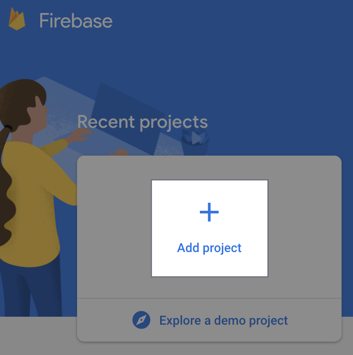
    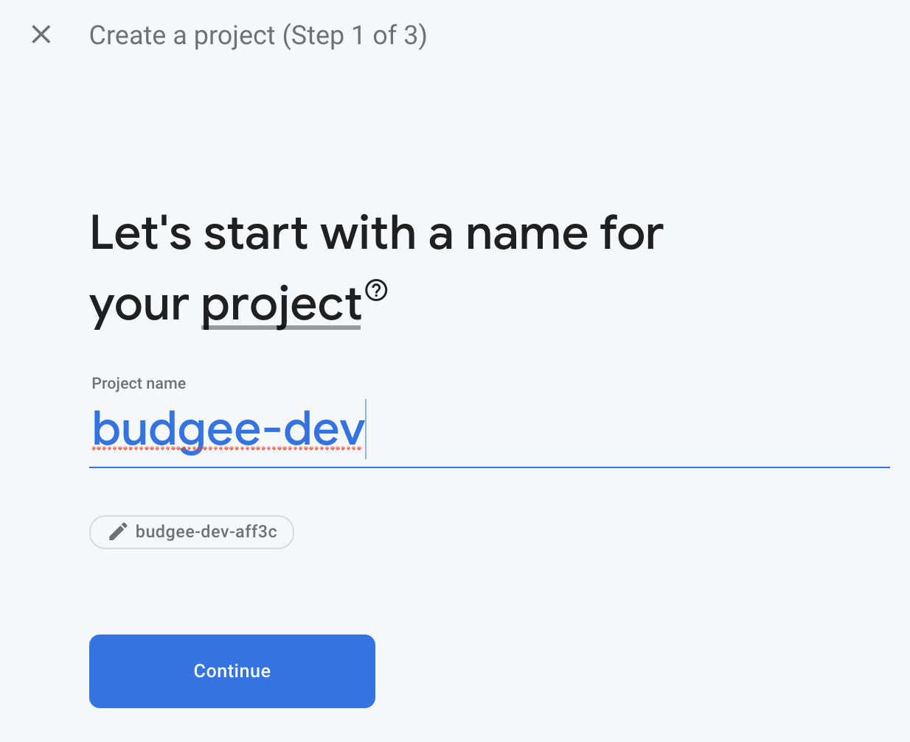

2. Disable Google Analytics.  Click **Create Project**.

    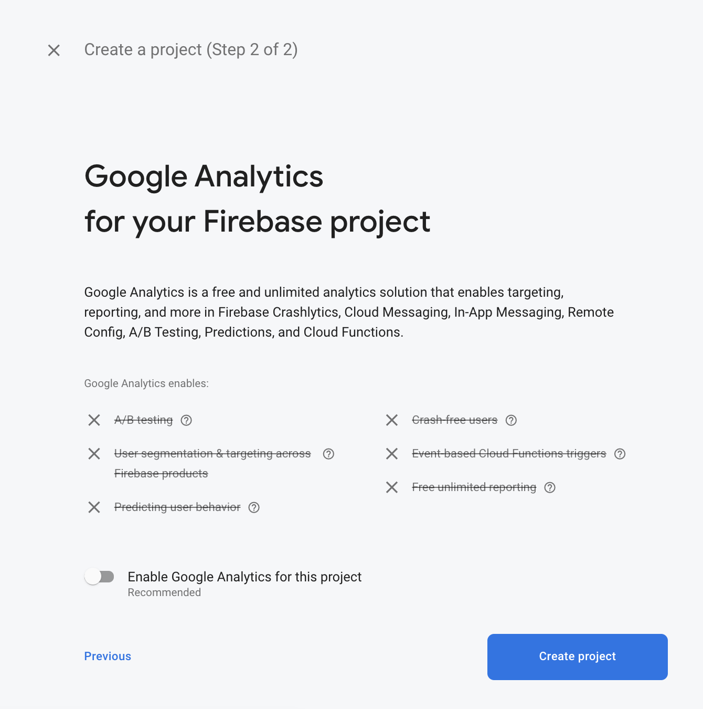

3. The project will be created.  Click **Continue** once it has been created.

    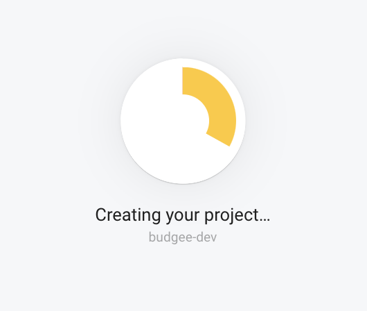
    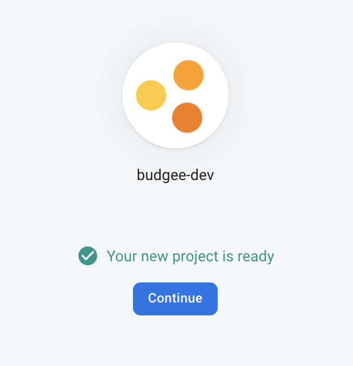

4. You will then be taken to the Firebase console project overview page.  Project creation is complete.

    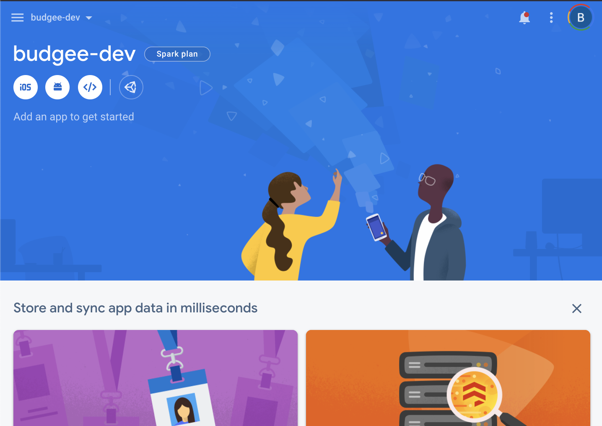

<br>

### Step 2: Register the Budgee web app with Firebase

1. In the center of the Firebase console's project overview page, click the **Web** icon **</>** to launch the setup workflow.

    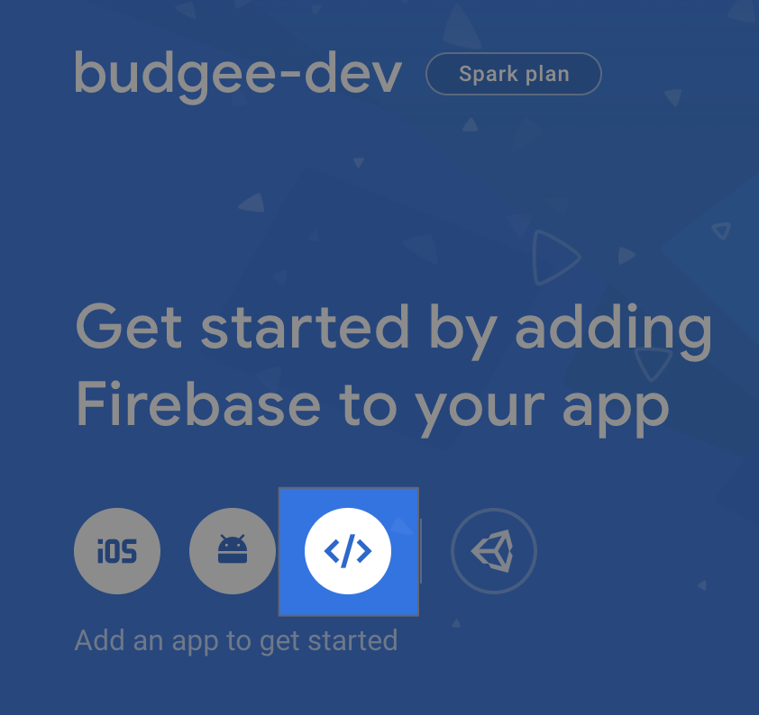

2. Enter your app's nickname.  In this case, `budgee`.  This nickname is an internal, convenience identifier and is only visible to you in the Firebase console.

    > We will not setup Hosting yet.  We will do this later.

3. Click Register app.

    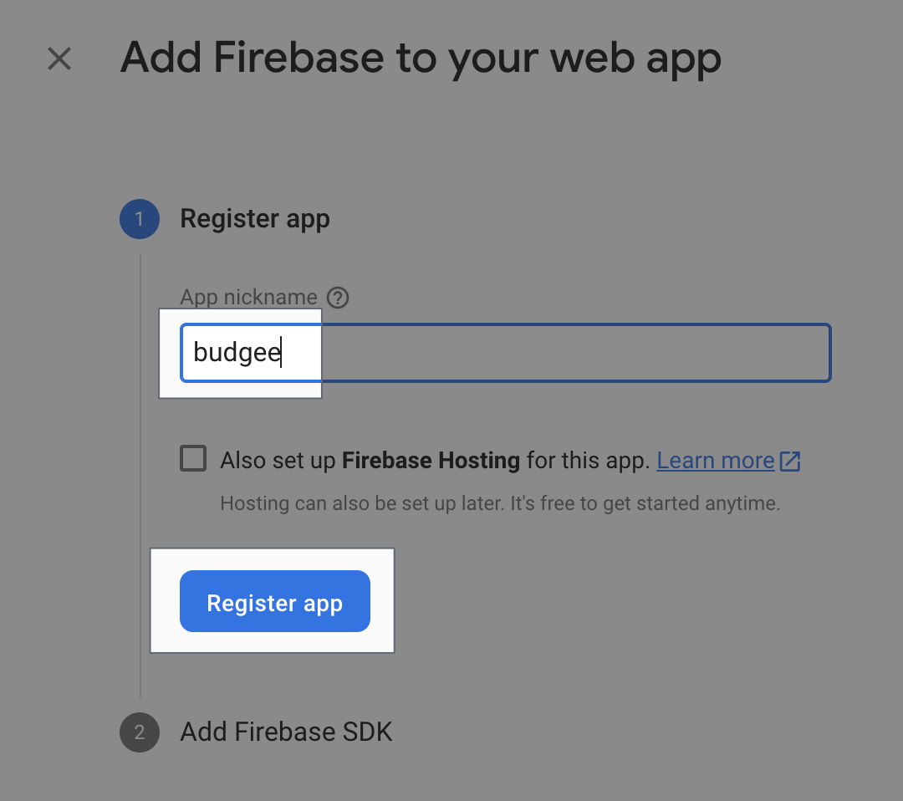

### Step 3: Add Firebase SDKs and initialize Firebase

There are a few [ways to add the Firebase Web SDKs](https://firebase.google.com/docs/web/learn-more#ways-to-add-web-sdks) to your web app (CDN, npm, hosting URLs etc).  We will use `yarn`.

1. Copy the Firebase configuration values from the Firebase console.  You will need these in the next steps.  Click `Continue to console`.

    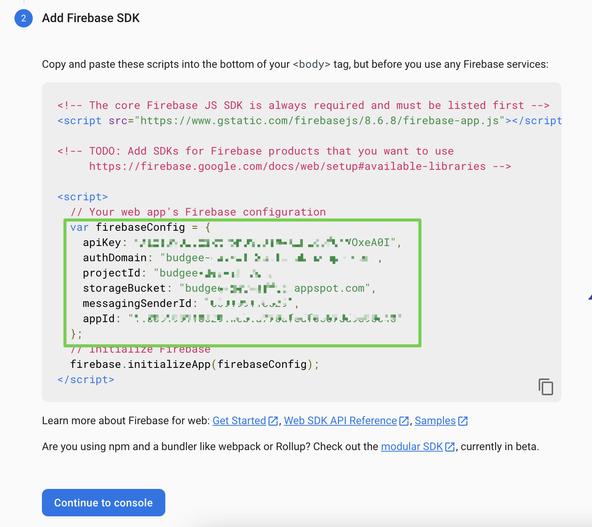

2. Install the Firebase SDK via yarn `yarn add firebase`

3. Using the config values you copied in the previous step, you can initialize your Firebase application.  This is done within [firebase.js](src/components/Firebase/firebase.js)

4. Provide Firebase in React

    > Following the example from [A Firebase in React Tutorial for Beginners](https://www.robinwieruch.de/complete-firebase-authentication-react-tutorial)

    Use React's Context API to provide a Firebase instance once at the top-level of your component hierarchy.  See [context.js](src/components/Firebase/context.js).

    For a well-encapsulated Firebase module, we'll define a [index.js](src/components/Firebase/index.js) file in our Firebase folder that exports all necessary functionalities (Firebase class, Firebase context for Consumer and Provider components):

    The Firebase Context from the Firebase module (folder) is used to provide a Firebase instance to your entire application in the [src/index.js](src/index.js) file.

    Doing it this way, we can be assured that Firebase is only instantiated once and that it is injected via React's Context API to React's component tree. Now, every component that is interested in using Firebase has access to the Firebase instance with a FirebaseContext.Consumer component.

    For example

    ```jsx
    import React from 'react';
    import  { FirebaseContext } from '../Firebase';
    
    const SomeComponent = () => (
        <FirebaseContext.Consumer>
            {firebase => {
                return <div>I've access to Firebase and render something</div>;
            }}
        </FirebaseContext.Consumer>
    );
 
    export default SomeComponent;
    ```

    Firebase and React are now connected

<br>

## Firebase Storage Setup

We will be using Firebase storage to store uploaded files and documents into Budgee, as a landing area for subsequent upload on contained data into Firebase Firestore database.  

For example, a monthly bank statement csv may be uploaded to Budgee.  It will land in Firebase Storage in the first instance for futher processing.

### Step 1: Create a default Cloud Storage bucket

1.  From the navigation pane of the [Firebase console](https://console.firebase.google.com/) select **Storage**, then click **Get started**.

    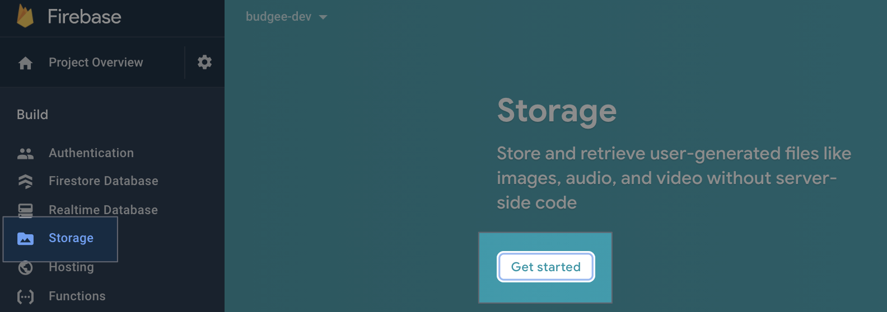

2.  Review the messaging about securing your Cloud Storage data using security rules. For now, we will leave the defaults.  Click **Done**.

    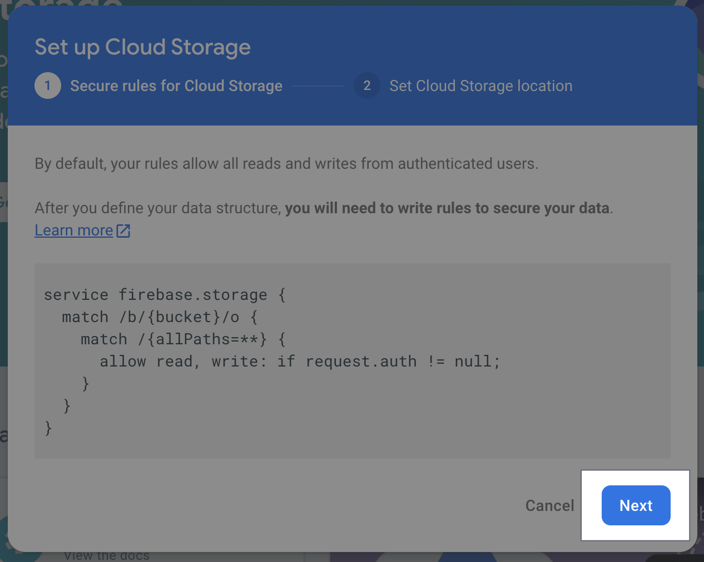

3.  Select `australia-southeast1` as the location for your default Cloud Storage bucket.  Click **Done**.

    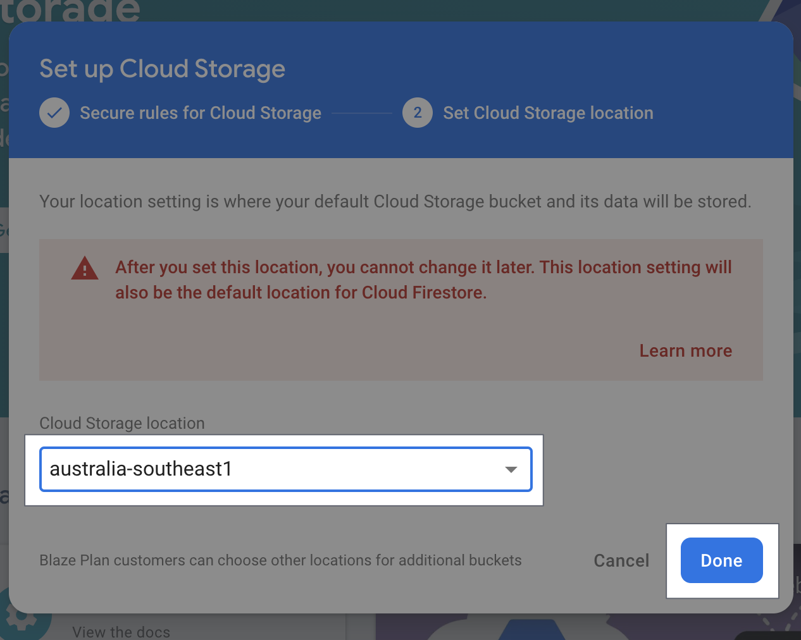

<br>

# Getting Started with Create React App

This project was bootstrapped with [Create React App](https://github.com/facebook/create-react-app).

## Available Scripts

In the project directory, you can run:

### `yarn start`

Runs the app in the development mode.\
Open [http://localhost:3000](http://localhost:3000) to view it in the browser.

The page will reload if you make edits.\
You will also see any lint errors in the console.

### `yarn test`

Launches the test runner in the interactive watch mode.\
See the section about [running tests](https://facebook.github.io/create-react-app/docs/running-tests) for more information.

### `yarn build`

Builds the app for production to the `build` folder.\
It correctly bundles React in production mode and optimizes the build for the best performance.

The build is minified and the filenames include the hashes.\
Your app is ready to be deployed!

See the section about [deployment](https://facebook.github.io/create-react-app/docs/deployment) for more information.

### `yarn eject`

**Note: this is a one-way operation. Once you `eject`, you can’t go back!**

If you aren’t satisfied with the build tool and configuration choices, you can `eject` at any time. This command will remove the single build dependency from your project.

Instead, it will copy all the configuration files and the transitive dependencies (webpack, Babel, ESLint, etc) right into your project so you have full control over them. All of the commands except `eject` will still work, but they will point to the copied scripts so you can tweak them. At this point you’re on your own.

You don’t have to ever use `eject`. The curated feature set is suitable for small and middle deployments, and you shouldn’t feel obligated to use this feature. However we understand that this tool wouldn’t be useful if you couldn’t customize it when you are ready for it.

## Learn More

You can learn more in the [Create React App documentation](https://facebook.github.io/create-react-app/docs/getting-started).

To learn React, check out the [React documentation](https://reactjs.org/).

### Code Splitting

This section has moved here: [https://facebook.github.io/create-react-app/docs/code-splitting](https://facebook.github.io/create-react-app/docs/code-splitting)

### Analyzing the Bundle Size

This section has moved here: [https://facebook.github.io/create-react-app/docs/analyzing-the-bundle-size](https://facebook.github.io/create-react-app/docs/analyzing-the-bundle-size)

### Making a Progressive Web App

This section has moved here: [https://facebook.github.io/create-react-app/docs/making-a-progressive-web-app](https://facebook.github.io/create-react-app/docs/making-a-progressive-web-app)

### Advanced Configuration

This section has moved here: [https://facebook.github.io/create-react-app/docs/advanced-configuration](https://facebook.github.io/create-react-app/docs/advanced-configuration)

### Deployment

This section has moved here: [https://facebook.github.io/create-react-app/docs/deployment](https://facebook.github.io/create-react-app/docs/deployment)

### `yarn build` fails to minify

This section has moved here: [https://facebook.github.io/create-react-app/docs/troubleshooting#npm-run-build-fails-to-minify](https://facebook.github.io/create-react-app/docs/troubleshooting#npm-run-build-fails-to-minify)
