# Budgee 🦜

Budgee has been built so that Brendan and Sarah don't have to spend time worrying about their finances.  

The reason I made this is because over the years, I've used many financial apps, tools, websites etc to manage and plan my finances.  None of them worked for me.  

Yes, I could use an Excel spreadsheet.  Buts its 2021!  Yes, I could spend >$50/month on financial software SaaS applications like Xero, MYOB.  But do I really need all the functionality they provide? No.  Does they actually work specifically for me?  No.

It's time to build something that automates my financial life, something that is scalable, something that integrates with all my financial accounts (banks, super, insurance, bills, invesmtent portfolios, crytpo accounts etc).

The goal is to be able to spend more time with my kids, my family, whilst being able to look at a dashboard when I'm walking down the hallway of my house, look at a monitor that is secured to my face, and see that everything is green and in check!

## Features

* Automatic imports of financial transactions
* Customized data modelling for bespoke data sources
* Ability to add account types e.g everyday insurance, mortgage, insurance, superannuation, bills, investments
* Areas of the wesbite for key "life pillars" e.g Health, Finances, House, Car, Kids etc

### Health Pillar

The Health pillar will provide functionality for

* Financials
* Vaccintions (for each family member)
* Medicare
* Schedule of Dental, Skin checks and appointments etc
* Recipes

## Tech Stack

### Backend

* Google Firebase Firestore - Database
* Google Firebase Storage - Blob/File Storage
* Google Firebase Hosting - Website hosting
* Google Firebase Functions - Serverless function

### Frontend

* React
* React Router
* Material UI / CSS

### Tools

* GitHub
* Visual Studio Code
* iTerm
* Fish shell
* Dracula Theme

 

# Installation

## Firebase Project Creation

We will be using a Firebase project to manage most of the Budgee backend ie database, hosting, functions, storage etc.

### Prerequisites

* Install your preferred editor or IDE.  For Budgee we are using [Visual Studio Code](https://code.visualstudio.com/).
* [Sign into Firebase](https://console.firebase.google.com/) using your Google account.

### Step 1: Create a Firebase project

1. In the [Firebase console](https://console.firebase.google.com/), click **Add project**, then select or enter a **Project name**.   Click **Continue**.

    
    

2. Disable Google Analytics.  Click **Create Project**.

    

3. The project will be created.  Click **Continue** once it has been created.

    
    

4. You will then be taken to the Firebase console project overview page.  Project creation is complete.

    

 

### Step 2: Register the Budgee web app with Firebase

1. In the center of the Firebase console's project overview page, click the **Web** icon **</>** to launch the setup workflow.

    

2. Enter your app's nickname.  In this case, `budgee`.  This nickname is an internal, convenience identifier and is only visible to you in the Firebase console.

    > We will not setup Hosting yet.  We will do this later.

3. Click Register app.

    

### Step 3: Add Firebase SDKs and initialize Firebase

There are a few [ways to add the Firebase Web SDKs](https://firebase.google.com/docs/web/learn-more#ways-to-add-web-sdks) to your web app (CDN, npm, hosting URLs etc).  We will use `yarn`.

1. Copy the Firebase configuration values from the Firebase console.  You will need these in the next steps.  Click `Continue to console`.

    

2. Install the Firebase SDK via yarn `yarn add firebase`

3. Using the config values you copied in the previous step, you can initialize your Firebase application.  This is done within [firebase.js](src/components/Firebase/firebase.js)

    Firebase and React are now connected

 

## Firebase Storage Setup

We will be using Firebase storage to store uploaded files and documents into Budgee, as a landing area for subsequent upload on contained data into Firebase Firestore database.  

For example, a monthly bank statement csv may be uploaded to Budgee.  It will land in Firebase Storage in the first instance for futher processing.

### Step 1: Create a default Cloud Storage bucket

1.  From the navigation pane of the [Firebase console](https://console.firebase.google.com/) select **Storage**, then click **Get started**.

    

2.  Review the messaging about securing your Cloud Storage data using security rules. For now, we will leave the defaults.  Click **Done**.

    

3.  Select `australia-southeast1` as the location for your default Cloud Storage bucket.  Click **Done**.

    

 

## Firebase Functions Setup

We will be using Firebase functions to response to various events in the application.  

For example, we run a cloud function to extract data from uploaded files (in Firebase Storage) and insert data records into Firebase Firestore.    

### Step 1: Set up Cloud Functions

Install the Firebase CLI 

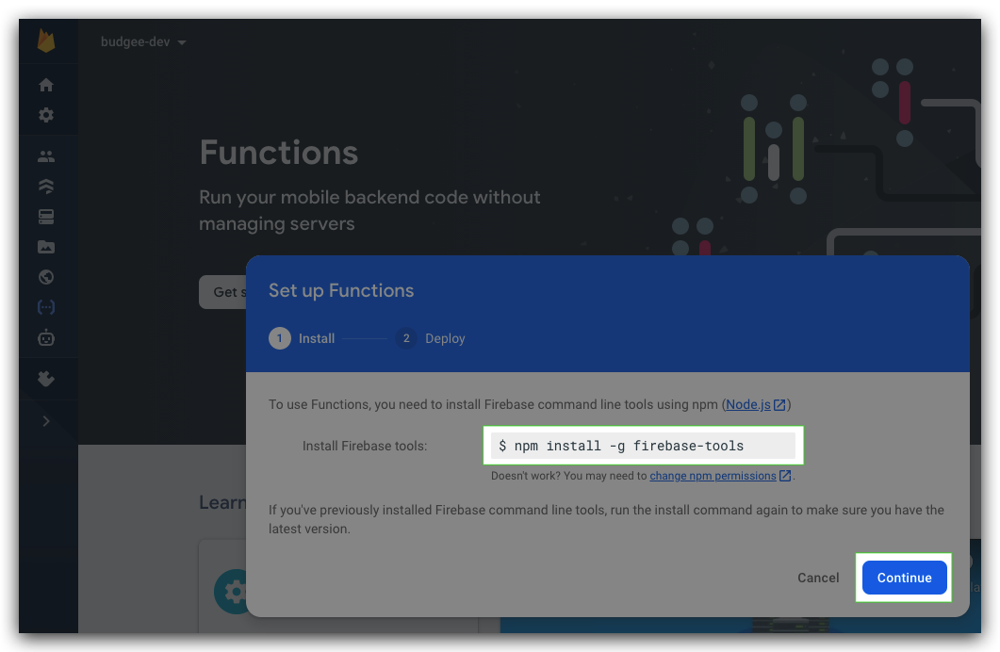

>`npm install -g firebase-tools`

The following wizards informs you on how to create functions.  We will click through these, but wont run the commands mentioned, just yet...

>   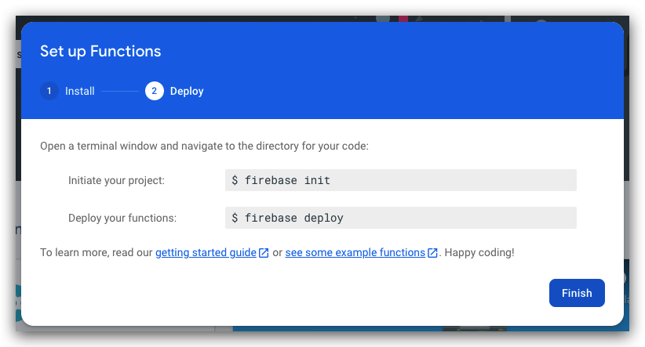
    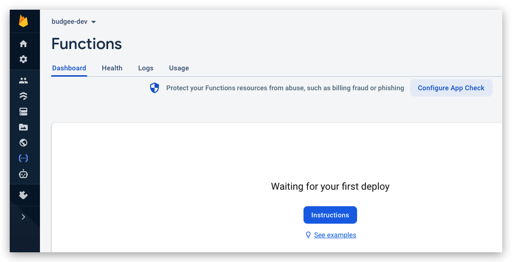

Initialize your project

1. Run `firebase login`
2. Navigate to a new directory that will contain your firebase function code (e.g `budgee/`)

3. Run `firebase init functions`

    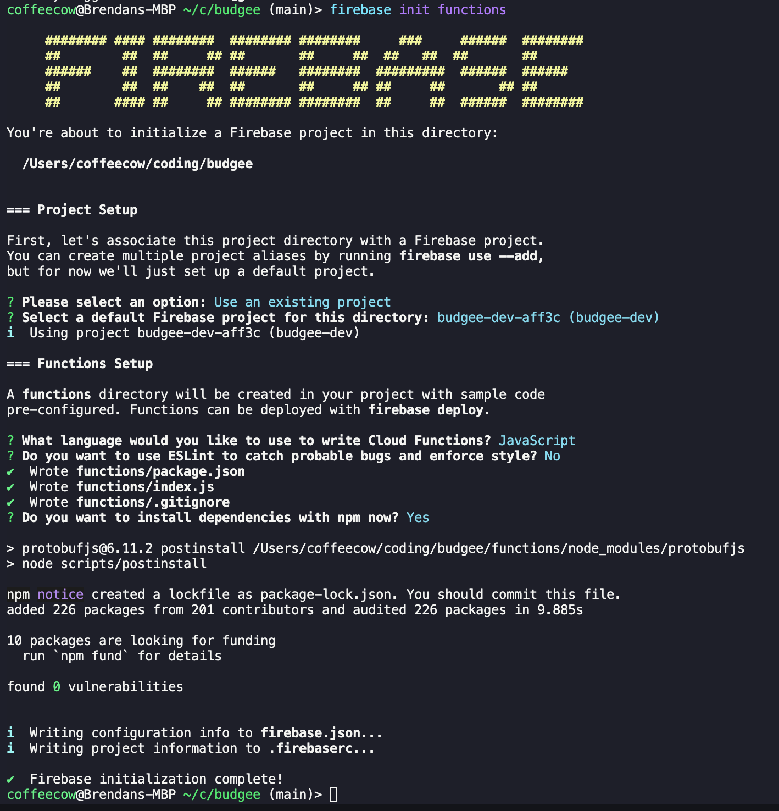

4. Run `npm install` in the `/functions` directory.

5. To use Functions you will need to upgrade your project's billing plan

    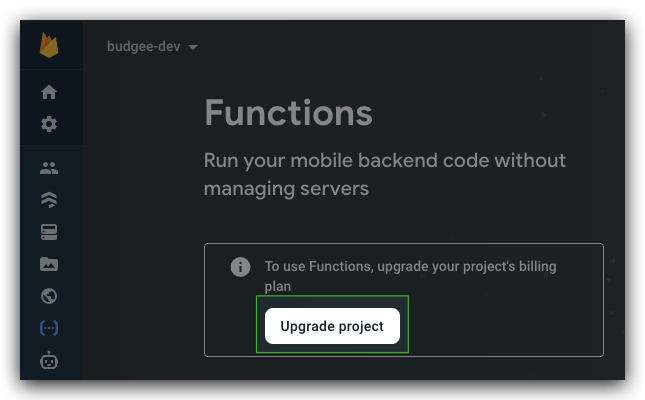
    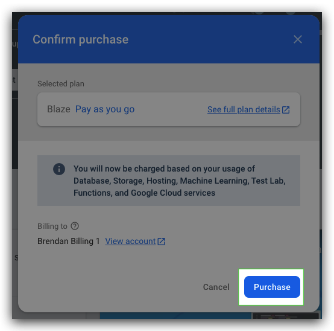
    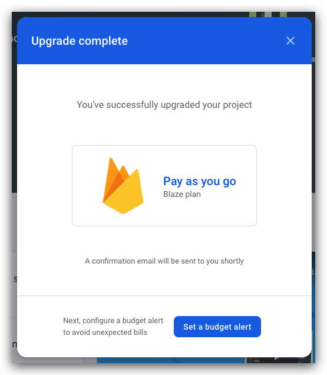

### Step 2: Write functions

Write JavaScript code (or TypeScript code to transpile at deployment) to handle events from Firebase services, Google Cloud services, or other event providers.

We will inevitably follow the process to write functions that respond to [Cloud Storage triggers](https://firebase.google.com/docs/functions/gcp-storage-events).  However to get started, we will use the the sample helloWorld function that was created during `firebase init functions`.

Uncomment the helloWorld function

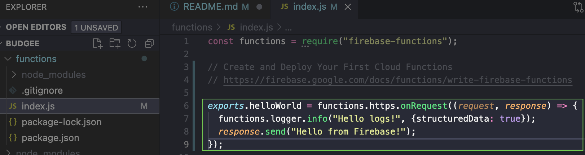

### Step 3: Test functions

Use the [local emulator](https://firebase.google.com/docs/functions/local-emulator) to test your functions.

More info [here](https://firebase.google.com/docs/emulator-suite/connect_and_prototype) and [here](https://firebase.google.com/docs/emulator-suite/install_and_configure)

1. Run `firebase init emulators`

    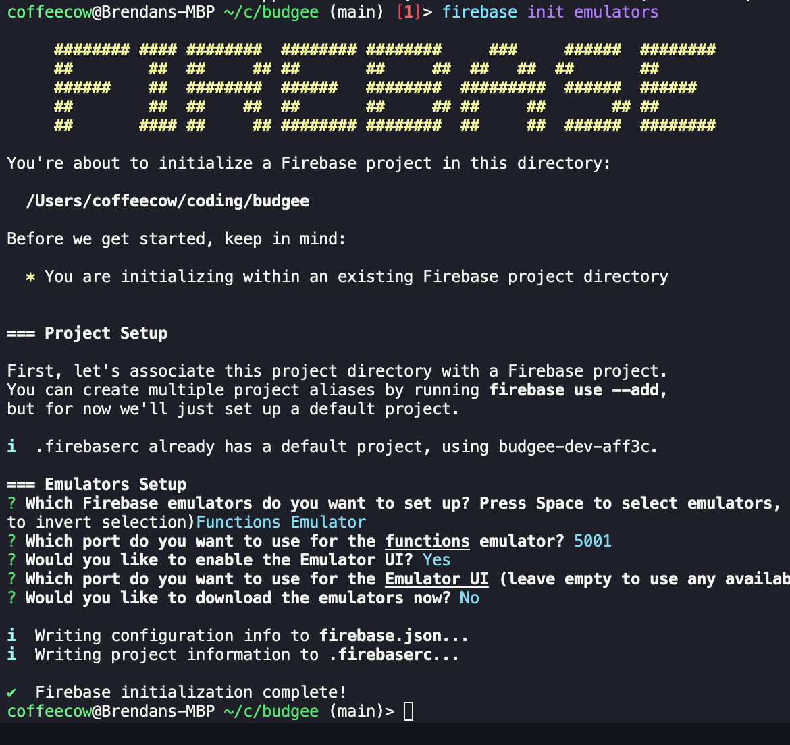

2. Run `firebase emulators:start` and check the output for the URL of the Emulator Suite UI. It defaults to localhost:4000, but may be hosted on a different port on your machine. Enter that URL in your browser to open the Emulator Suite UI.

    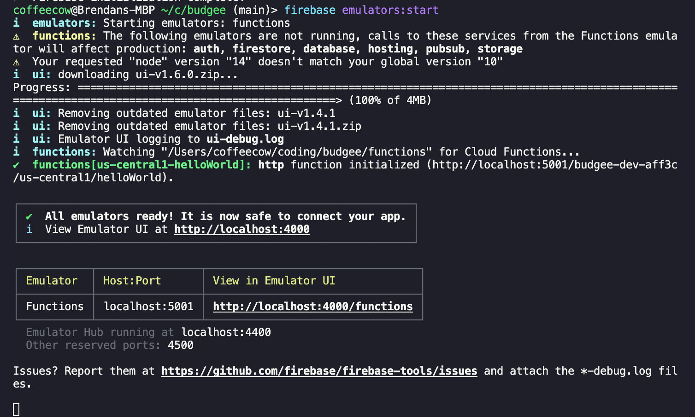
    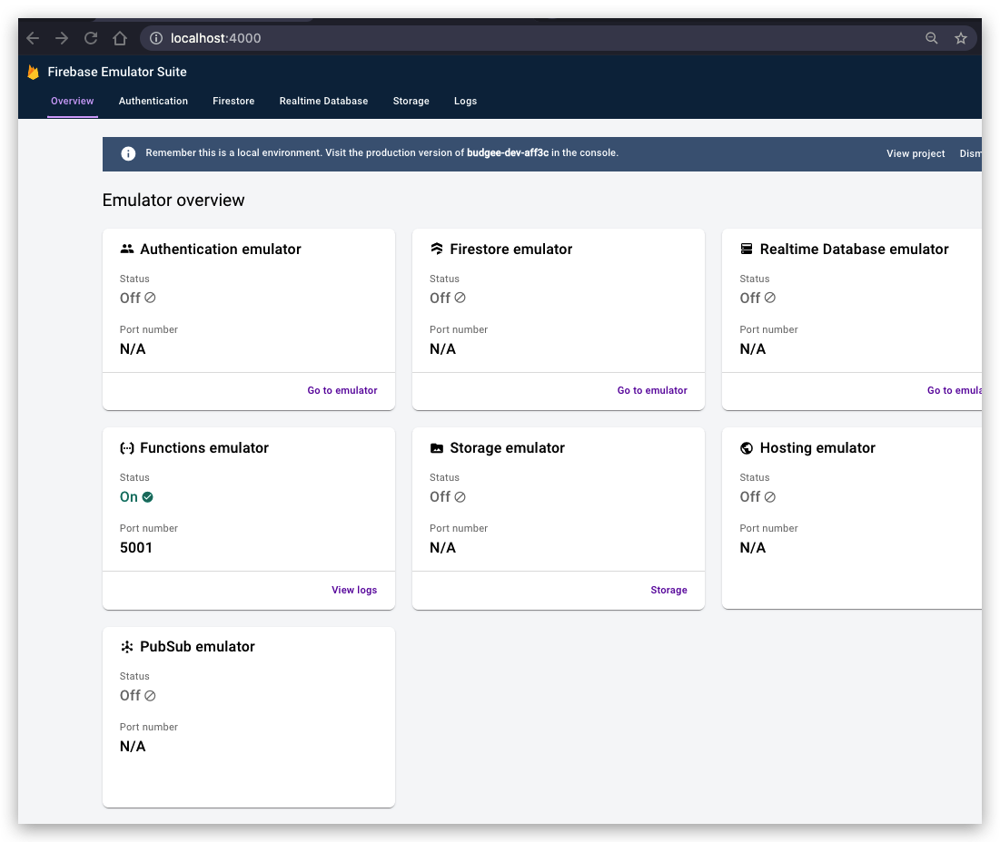

3. Test the helloWorld function by browsing to the URL listed after firebase emulator starts up.  You will also be able to check the Functions Emulator logs.

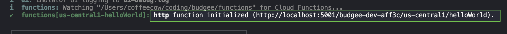
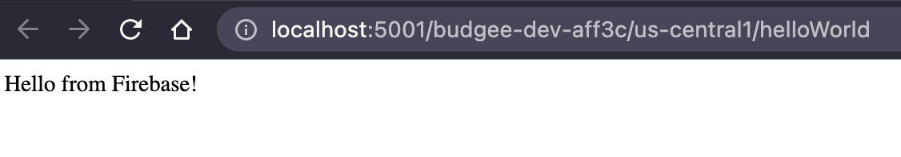
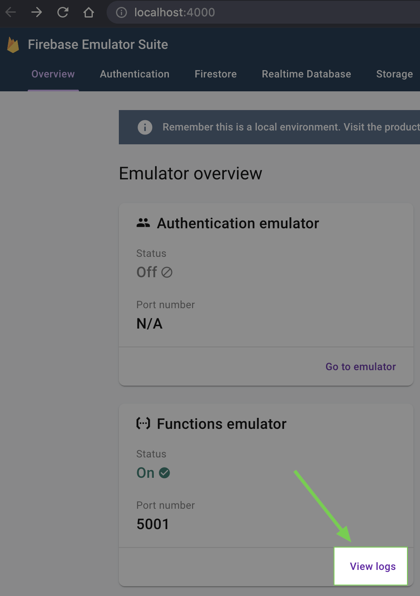
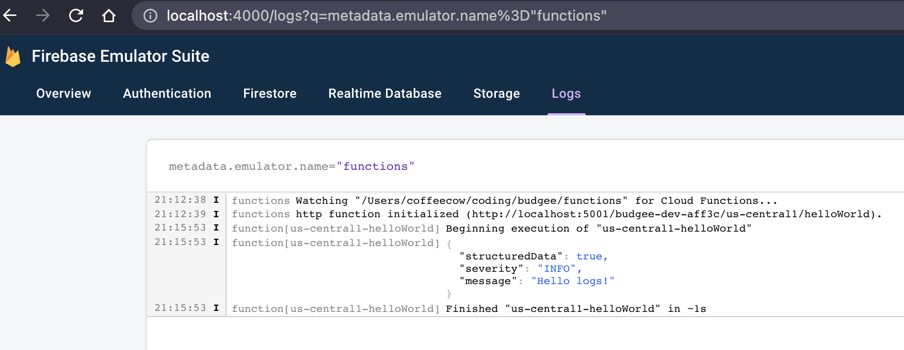

### Step 4: Deploy and monitor	

Enable billing for your project and deploy your functions using the Firebase CLI. You can use the Firebase console to view and search through your logs.

Once your functions are working as desired in the emulator, you can proceed to deploying, testing, and running them in the production environment.

1. Run this command to deploy your functions

> `firebase deploy --only functions`

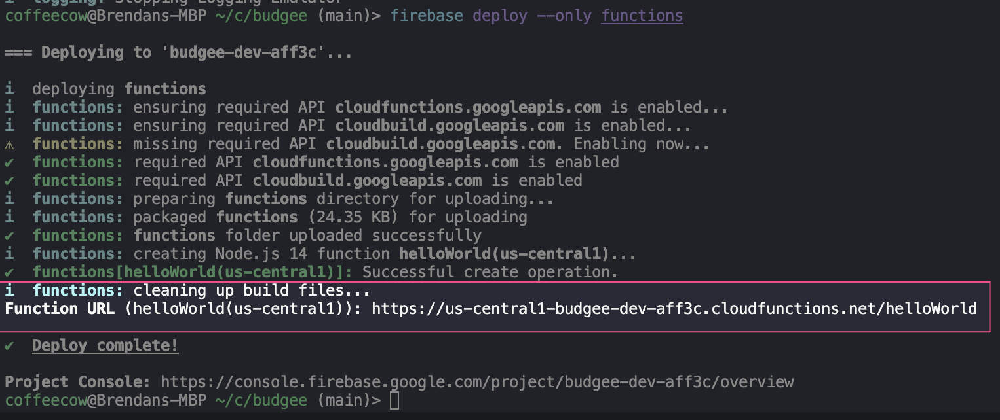

After you run this command, the Firebase CLI outputs the URL for any HTTP function endpoints. In your terminal, you should see a line like the following:

> https://us-central1-budgee-dev-aff3c.cloudfunctions.net/helloWorld

After deploying, you will see your function in the Firebase console

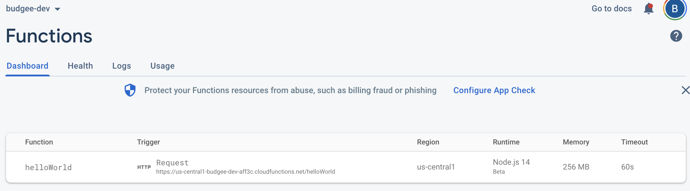

You can execute your function

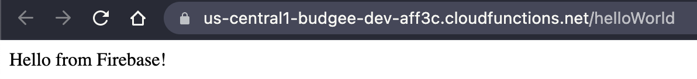

You can also [view logs in the Firebase console for Cloud Functions](https://console.firebase.google.com/project/_/functions/logs?search=&severity=DEBUG). 

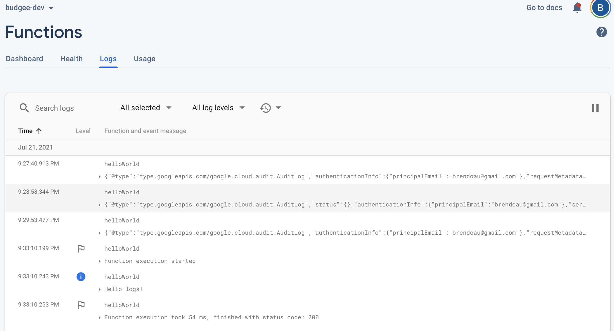

If you need to [delete functions](https://firebase.google.com/docs/functions/manage-functions#delete_functions) in development or production, use the Firebase CLI.

# Getting Started with Create React App

This project was bootstrapped with [Create React App](https://github.com/facebook/create-react-app).

## Available Scripts

In the project directory, you can run:

### `yarn start`

Runs the app in the development mode.\
Open [http://localhost:3000](http://localhost:3000) to view it in the browser.

The page will reload if you make edits.\
You will also see any lint errors in the console.

### `yarn test`

Launches the test runner in the interactive watch mode.\
See the section about [running tests](https://facebook.github.io/create-react-app/docs/running-tests) for more information.

### `yarn build`

Builds the app for production to the `build` folder.\
It correctly bundles React in production mode and optimizes the build for the best performance.

The build is minified and the filenames include the hashes.\
Your app is ready to be deployed!

See the section about [deployment](https://facebook.github.io/create-react-app/docs/deployment) for more information.

### `yarn eject`

**Note: this is a one-way operation. Once you `eject`, you can’t go back!**

If you aren’t satisfied with the build tool and configuration choices, you can `eject` at any time. This command will remove the single build dependency from your project.

Instead, it will copy all the configuration files and the transitive dependencies (webpack, Babel, ESLint, etc) right into your project so you have full control over them. All of the commands except `eject` will still work, but they will point to the copied scripts so you can tweak them. At this point you’re on your own.

You don’t have to ever use `eject`. The curated feature set is suitable for small and middle deployments, and you shouldn’t feel obligated to use this feature. However we understand that this tool wouldn’t be useful if you couldn’t customize it when you are ready for it.

## Learn More

You can learn more in the [Create React App documentation](https://facebook.github.io/create-react-app/docs/getting-started).

To learn React, check out the [React documentation](https://reactjs.org/).

### Code Splitting

This section has moved here: [https://facebook.github.io/create-react-app/docs/code-splitting](https://facebook.github.io/create-react-app/docs/code-splitting)

### Analyzing the Bundle Size

This section has moved here: [https://facebook.github.io/create-react-app/docs/analyzing-the-bundle-size](https://facebook.github.io/create-react-app/docs/analyzing-the-bundle-size)

### Making a Progressive Web App

This section has moved here: [https://facebook.github.io/create-react-app/docs/making-a-progressive-web-app](https://facebook.github.io/create-react-app/docs/making-a-progressive-web-app)

### Advanced Configuration

This section has moved here: [https://facebook.github.io/create-react-app/docs/advanced-configuration](https://facebook.github.io/create-react-app/docs/advanced-configuration)

### Deployment

This section has moved here: [https://facebook.github.io/create-react-app/docs/deployment](https://facebook.github.io/create-react-app/docs/deployment)

### `yarn build` fails to minify

This section has moved here: [https://facebook.github.io/create-react-app/docs/troubleshooting#npm-run-build-fails-to-minify](https://facebook.github.io/create-react-app/docs/troubleshooting#npm-run-build-fails-to-minify)
